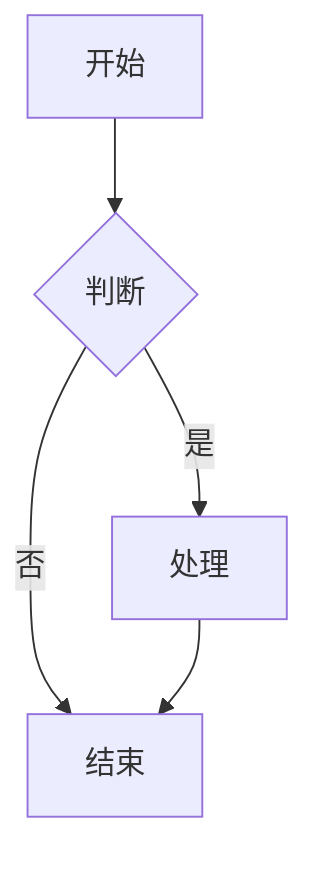

# NoteForge Markdown 语法完全展示

> **用途:** 本文件完整展示 NoteForge 桌面端编辑器支持的所有 Markdown 语法及自定义扩展语法。
> **编辑器版本:** v2.3 (Phase 1+2+3 部分完成)
> **转换器测试:** 126 用例全部通过 ✅

---

## 目录

- [一、基础格式化](#一基础格式化)
- [二、标题系统](#二标题系统)
- [三、列表系统](#三列表系统)
- [四、代码块系统](#四代码块系统)
- [五、表格系统](#五表格系统)
- [六、引用与分割线](#六引用与分割线)
- [七、链接与媒体](#七链接与媒体)
- [八、扩展语法](#八扩展语法)
- [九、混合示例](#九混合示例)

---

## 一、基础格式化

### 1.1 行内格式

| 语法 | 效果 | 状态 |
|------|------|:----:|
| `**加粗**` | **加粗** | ✅ 完成 |
| `*斜体*` | *斜体* | ✅ 完成 |
| `***粗斜体***` | ***粗斜体*** | ✅ 完成 |
| `~~删除线~~` | ~~删除线~~ | ✅ 完成 |
| `__下划线__` | __下划线__ | ✅ 完成 |
| `` `行内代码` `` | `行内代码` | ✅ 完成 |
| `^^高亮^^` | ^^高亮^^ | ✅ 完成 |
| `<https://x.com>` | 自动链接 | ✅ 完成 |
| `H~2~O` 下标 | H~2~O | ⬜ 计划中 |
| `^上标^` 上标 | ^上标^ | ⬜ 计划中 |

### 1.2 实体转义

```
AT&T → AT&T (自动转义)
<div> → &lt;div&gt; (自动转义)
```

✅ 完成

---

## 二、标题系统

### 2.1 H1-H6 完整支持

```markdown
# 标题 1
## 标题 2
### 标题 3
#### 标题 4
##### 标题 5
###### 标题 6
```

| 级别 | 状态 |
|:----:|:----:|
| H1 | ✅ 完成 |
| H2 | ✅ 完成 |
| H3 | ✅ 完成 |
| H4 | ✅ 完成 |
| H5 | ✅ 完成 |
| H6 | ✅ 完成 |

### 2.2 段落

普通段落文本。多个连续段落之间用空行分隔。

这是第二段。段落自动包裹在 `<p>` 标签中。

---

## 三、列表系统

### 3.1 无序列表

```markdown
- 苹果
- 香蕉
- 樱桃
```

- 苹果
- 香蕉
- 樱桃

### 3.2 有序列表

```markdown
1. 第一项
2. 第二项
3. 第三项
```

1. 第一项
2. 第二项
3. 第三项

### 3.3 嵌套列表

```markdown
- 水果
  - 苹果
  - 香蕉
    - 巴西香蕉
    - 小米蕉
- 蔬菜
  1. 白菜
  2. 萝卜
```

- 水果
  - 苹果
  - 香蕉
    - 巴西香蕉
    - 小米蕉
- 蔬菜
  1. 白菜
  2. 萝卜

✅ 完成 — 支持多级嵌套，混合列表类型

### 3.4 任务列表

```markdown
- [x] 已完成任务
- [ ] 未完成任务
- [ ] 待办事项
```

- [x] 已完成任务
- [ ] 未完成任务
- [ ] 待办事项

✅ 完成 — 支持点击切换状态 (WYSIWYG 模式)

---

## 四、代码块系统

### 4.1 无语言标记

```
Plain code block without language.
```

### 4.2 带语言标记 (语法高亮)

```typescript
interface Note {
  meta: NoteMeta;
  content: string;
  contentPlain: string;
}

function formatDate(ts: number): string {
  const diff = Date.now() - ts;
  if (diff < 60000) return 'just now';
  return `${Math.floor(diff / 60000)}m ago`;
}
```

```python
def fibonacci(n: int) -> list[int]:
    """Generate Fibonacci sequence up to n terms."""
    fib = [0, 1]
    for i in range(2, n):
        fib.append(fib[i-1] + fib[i-2])
    return fib[:n]

print(fibonacci(10))
# Output: [0, 1, 1, 2, 3, 5, 8, 13, 21, 34]
```

```rust
use serde::{Deserialize, Serialize};

#[derive(Debug, Serialize, Deserialize)]
struct Note {
    id: String,
    title: String,
    content: String,
    tags: Vec<String>,
}

impl Note {
    fn new(title: &str) -> Self {
        Self {
            id: uuid::Uuid::new_v4().to_string(),
            title: title.to_string(),
            content: String::new(),
            tags: Vec::new(),
        }
    }
}
```

```javascript
// Async/await example
async function fetchUserData(userId) {
  try {
    const response = await fetch(`/api/users/${userId}`);
    if (!response.ok) throw new Error('Network error');
    return await response.json();
  } catch (error) {
    console.error('Failed to fetch user:', error);
    throw error;
  }
}

// Arrow functions & destructuring
const processItems = ({ items, filter }) => {
  return items
    .filter(item => item.status === filter)
    .map(({ id, name }) => ({ id, name }));
};
```

```bash
#!/bin/bash
# File backup script
BACKUP_DIR="/backups/$(date +%Y%m%d)"
mkdir -p "$BACKUP_DIR"

for file in "$@"; do
  if [ -f "$file" ]; then
    cp "$file" "$BACKUP_DIR/"
    echo "Backed up: $file"
  else
    echo "Skipping: $file (not a file)"
  fi
done
```

### 4.3 行内代码

在段落中可以使用 `行内代码` 来标记代码片段，例如 `const x = 42` 和 `npm run build`。

| 能力 | 状态 |
|------|:----:|
| 语法高亮 (190+ 语言) | ✅ 完成 (lowlight + highlight.js) |
| 语言选择器 (40+ 语言) | ✅ 完成 (CodeBlockLang 扩展) |
| 行号显示 | ✅ 完成 (`data-line-nums`) |
| 代码复制按钮 | ✅ 完成 |
| 语言自动检测 | ❌ 需手动选择 |

---

## 五、表格系统

### 5.1 基本表格

```markdown
| 名称 | 版本 | 描述 |
|------|------|------|
| TypeScript | 5.5 | 类型安全 JavaScript |
| Rust | 1.80 | 系统编程语言 |
| Python | 3.12 | 通用编程语言 |
```

| 名称 | 版本 | 描述 |
|------|------|------|
| TypeScript | 5.5 | 类型安全 JavaScript |
| Rust | 1.80 | 系统编程语言 |
| Python | 3.12 | 通用编程语言 |

### 5.2 对齐表格

```markdown
| 左对齐 | 居中对齐 | 右对齐 |
|:-------|:--------:|-------:|
| 文本   | 文本     | 文本   |
| 长文本内容 | 长文本内容 | 长文本内容 |
```

| 左对齐 | 居中对齐 | 右对齐 |
|:-------|:--------:|-------:|
| 文本 | 文本 | 文本 |
| 长文本内容 | 长文本内容 | 长文本内容 |

### 5.3 空单元格

```markdown
| 列 A | 列 B | 列 C |
|------|------|------|
| A1   |      | C1   |
|      | B2   | C2   |
| A3   | B3   |      |
```

| 列 A | 列 B | 列 C |
|------|------|------|
| A1 | | C1 |
| | B2 | C2 |
| A3 | B3 | |

| 能力 | 状态 |
|------|:----:|
| GFM pipe table 双向转换 | ✅ 完成 |
| 对齐 (左/中/右) | ✅ 完成 |
| 插入/删除行 | ✅ 完成 (TipTap) |
| Tab 单元格导航 | ✅ 完成 (TableHelper) |
| Enter 新增行 | ✅ 完成 (TableHelper) |
| CSV 粘贴导入 | ⬜ 计划中 |
| 表格排序 | ⬜ 计划中 |

---

## 六、引用与分割线

### 6.1 块引用

```markdown
> 这是一段引用文本。
> 引用可以跨多行。
>
> > 引用可以嵌套。
```

> 这是一段引用文本。
> 引用可以跨多行。
>
> > 引用可以嵌套。

### 6.2 分割线

```markdown
---
```

以上三个短横线产生一条分割线。

---

## 七、链接与媒体

### 7.1 超链接

```markdown
[NoteForge GitHub](https://github.com/noteforge/noteforge)
```

[NoteForge GitHub](https://github.com/noteforge/noteforge)

### 7.2 图片

```markdown

```


图片支持 URL 插入、拖拽上传、粘贴剪贴板、对齐设置 (左/中/右)。

```markdown

```

(对齐操作在 WYSIWYG 模式下通过图片浮动工具栏完成)

| 能力 | 状态 |
|------|:----:|
| URL 插入图片 | ✅ 完成 |
| 拖拽上传图片 | ✅ 完成 |
| 粘贴剪贴板图片 | ✅ 完成 |
| 图片对齐 (左/中/右) | ✅ 完成 |
| 图片 Alt 文本保留 | ✅ 完成 |
| 图片内联预览 (源码模式) | ✅ 完成 |
| 图片标题 Caption | ⬜ 计划中 |

---

## 八、Callout 警示块

```
> [!note] 标题
> 内容

> [!warning] 标题
> 内容
```

> [!note] 备注
> 这是一条备注信息。支持 **加粗** 和 `行内代码`。

> [!warning] 注意
> 请留意这个警告。

> [!tip] 小技巧
> 这是一个实用提示。

> [!danger] 危险
> 这是危险警告！

| 类型 | 状态 |
|------|:----:|
| note / warning / tip / danger | ✅ 完成 |
| info / success / question | ✅ 完成 |
| 自定义图标和颜色 | ⬜ 计划中 |

---

## 九、扩展语法

### 9.1 Frontmatter 元数据

```markdown
---
title: 语法展示
tags: [demo, reference]
created: 2026-07-07
---
```

编辑器会自动识别文件开头的 `---` 包裹的 YAML 元数据，在渲染时显示为元数据块。

| 字段 | 状态 |
|------|:----:|
| `title` | ✅ 完成 (识别与显示) |
| `tags` | ✅ 完成 |
| `created` / `updated` | ✅ 完成 |
| 可视化 Frontmatter 编辑面板 | ⬜ 计划中 |

### 9.2 高亮语法

```
^^highlight^^ → <mark>highlight</mark>
```

^^高亮文本^^ 可用于强调关键内容。

✅ 完成

### 9.3 自动链接

```
<https://example.com> → <a href="https://example.com">https://example.com</a>
```

✅ 完成 — 支持 HTTPS/HTTP URL 自动识别

### 9.4 Wiki Links (双向链接)

```markdown
[[Note Title]] — 链接到其他笔记
```

在编辑器中显示为可点击的蓝色链接按钮，点击跳转到对应笔记。

| 能力 | 状态 |
|------|:----:|
| `[[笔记标题]]` 语法解析 | ✅ 完成 (Converter) |
| 装饰渲染 (CodeMirror) | ✅ 完成 (cm-wiki-link 装饰) |
| 点击导航跳转 | ✅ 完成 |
| 悬停预览浮窗 | ✅ 完成 |
| 反向链接面板 | ✅ 完成 |
| `[[` 自动完成匹配 | ✅ 完成 |
| 链接不存在提示 | ⬜ 计划中 |

### 8.2 标签语法

```markdown
本文包含 #标签 和 #Rust/编程 和 #日常/2026-07
```

在编辑器中显示为高亮标签。

✅ 完成 — 支持字母和中文标签，支持 `/` 层级标签

### 8.3 Frontmatter 元数据 (部分支持)

```markdown
---
title: 语法展示
tags: [demo, reference]
created: 2026-07-07
---
```

| 能力 | 状态 |
|------|:----:|
| `title` | ⬜ 部分 |
| `tags` | ⬜ 部分 |
| `created` / `updated` | ✅ (数据库) |
| 可视化 Frontmatter 面板 | ❌ 未开始 |

### 8.4 高亮语法 (计划中)

```markdown
^^highlight^^ — 文本高亮 (计划中)
```

❌ 未开始

### 8.5 Callout 警示块 (计划中)

```markdown
> [!note] 备注
> 这是备注内容。

> [!warning] 警告
> 请注意这个警告。

> [!tip] 提示
> 这是一个小提示。

> [!danger] 危险
> 这是危险警告！
```

❌ Phase 3 计划中

### 8.6 数学公式 (计划中)

```markdown
行内公式: $E = mc^2$

块级公式:

$$
\frac{-b \pm \sqrt{b^2 - 4ac}}{2a}
$$
```

❌ Phase 3 计划中

### 8.7 Mermaid 图表 (计划中)

````markdown

````

❌ Phase 3 计划中

---

## 十、混合示例

### 10.1 完整笔记模板

```markdown
# 项目会议纪要 — 2026-07-07

**日期:** 2026-07-07
**参与人:** @Alice, @Bob, @Charlie
**标签:** #会议/周会 #项目-A

---

## 议程

1. 上周进展回顾
2. 本周计划讨论
3. 风险与问题

## 上周进展

| 模块 | 负责人 | 状态 | 备注 |
|:-----|:-------|:----:|:-----|
| 编辑器重构 | Alice | ✅ 完成 | Phase 1 已交付 |
| 后端API | Bob | 🟡 进行中 | 预计下周完成 |
| 移动端 | Charlie | 🔴 阻塞 | 等待设计稿 |

## 讨论要点

> **Alice:** 编辑器 Phase 2 进展顺利，`[[SlashMenu]]` 和 `#WYSIWYG` 功能已就绪。
>
> **Bob:** API 网关需要增加限流配置，详见 `[[API Design]]`。

### 代码示例

```typescript
// 编辑器扩展注册
const extensions = getAllExtensions({
  enableBuiltins: true,
  enableSlashMenu: true,
});
```

## 待办事项

- [x] Alice: 提交 Phase 2 PR
- [ ] Bob: 完成 API 网关限流配置
- [ ] Charlie: 周五前确认移动端设计稿

---

*最后更新: 2026-07-07 14:30*
```

### 10.2 知识库笔记

```markdown
# Rust 所有权系统

## 核心规则
1. 每个值在 Rust 中都有且只有一个所有者
2. 当所有者离开作用域，值将被丢弃
3. 引用规则

## 代码示例

```rust
fn main() {
    let s1 = String::from("hello");
    let s2 = &s1;  // 借用, 不转移所有权
    println!("{}", s1); // 仍然可用
    println!("{}", s2);
}
```

## 相关笔记
- [[Rust 生命周期]]
- [[Rust 借用检查器]]

## 标签
#Rust #编程/系统编程 #所有权
```

---

## 附录：语法支持状态总表

| 语法类别 | 具体语法 | 状态 | 对应 Phase |
|----------|----------|:----:|:----------:|
| **基础格式** | 加粗/斜体/粗斜体/删除线/下划线/行内代码 | ✅ | Phase 1 |
| **标题** | H1-H6 完整支持 | ✅ | Phase 1+2 |
| **实体转义** | & < > " | ✅ | Phase 1 |
| **无序列表** | `- ` 标记 | ✅ | Phase 1 |
| **有序列表** | `1. ` 标记 | ✅ | Phase 1 |
| **嵌套列表** | 多级缩进/混合类型 | ✅ | Phase 1 |
| **任务列表** | `- [x]` / `- [ ]` | ✅ | Phase 1 |
| **代码块** | 语法高亮 + 复制按钮 | ✅ | Phase 1+2 |
| **代码语言选择** | 40+ 语言下拉选择 | ✅ | Phase 2 |
| **行号** | data-line-nums | ✅ | Phase 1 |
| **表格** | GFM pipe table | ✅ | Phase 1 |
| **表格对齐** | 左/中/右 | ✅ | Phase 1 |
| **表格键盘导航** | Tab/Enter 操作 | ✅ | Phase 2 |
| **引用** | `> ` 标记 | ✅ | Phase 1 |
| **分割线** | `---` | ✅ | Phase 1 |
| **链接** | `[text](url)` | ✅ | Phase 1 |
| **图片** | URL/拖拽/粘贴 | ✅ | Phase 1+2 |
| **图片对齐** | 左/中/右 | ✅ | Phase 1 |
| **链接悬停预览** | 鼠标悬停显示 URL | ✅ | Phase 2 |
| **斜杠命令** | `/` 触发浮层菜单 | ✅ | Phase 2 |
| **Wiki Link** | `[[笔记标题]]` | ✅ | Phase 1 |
| **标签** | `#tag` | ✅ | Phase 1 |
| **搜索高亮** | 编辑器内搜索匹配高亮 | ✅ | Phase 1 |
| **WYSIWYG 编辑** | TipTap 实时编辑 | ✅ | Phase 1 |
| **源码模式** | CodeMirror 6 | ✅ | Phase 1 |
| **模式切换** | WYSIWYG ↔ Source | ✅ | Phase 1 |
| **插件系统** | PluginManager + PluginAPI | ✅ | Phase 2 |
| **Callout 警示块** | `> [!note/warning/tip/danger]` | ✅ | Phase 3 |
| **Frontmatter** | `---\ntitle: X\n---` | ✅ | Phase 3 |
| **高亮** | `^^text^^` | ✅ | Phase 3 |
| **自动链接** | `<https://x.com>` | ✅ | Phase 3 |
| **数学公式** | `$...$` `$$...$$` | ❌ | Phase 3 |
| **Mermaid 图表** | ` ```mermaid` | ❌ | Phase 3 |
| **双栏模式** | 编辑+预览分栏 | ✅ | Phase 4 |
| **阅读模式** | 干净只读渲染 | ⬜ | Phase 4 |
| **AI 写作** | 续写/改写/翻译 | ⬜ | Phase 4 |
